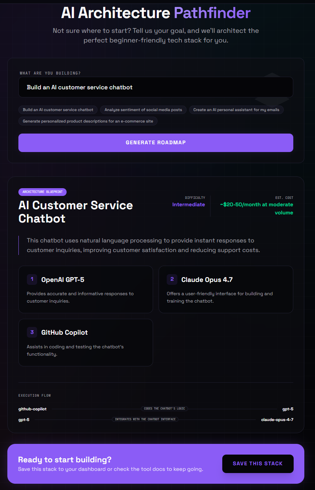
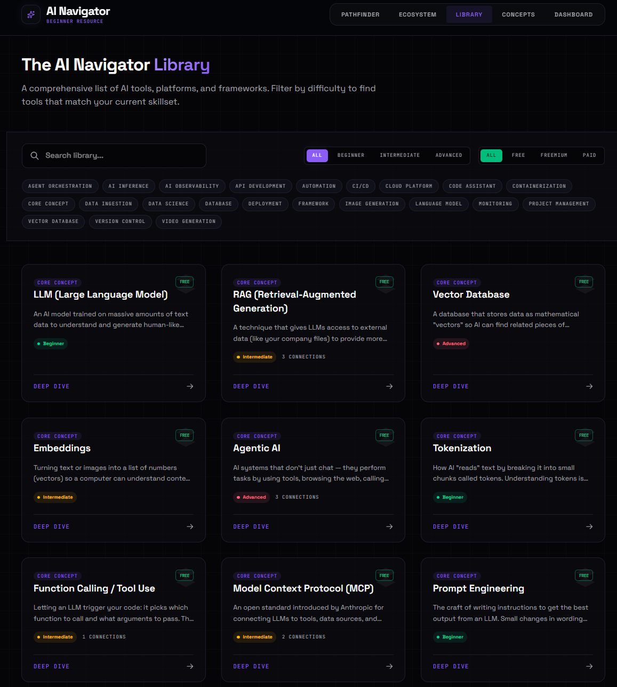
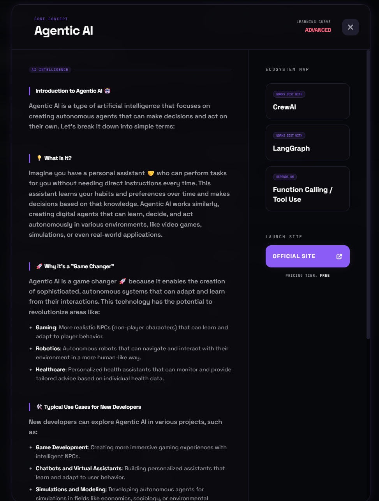
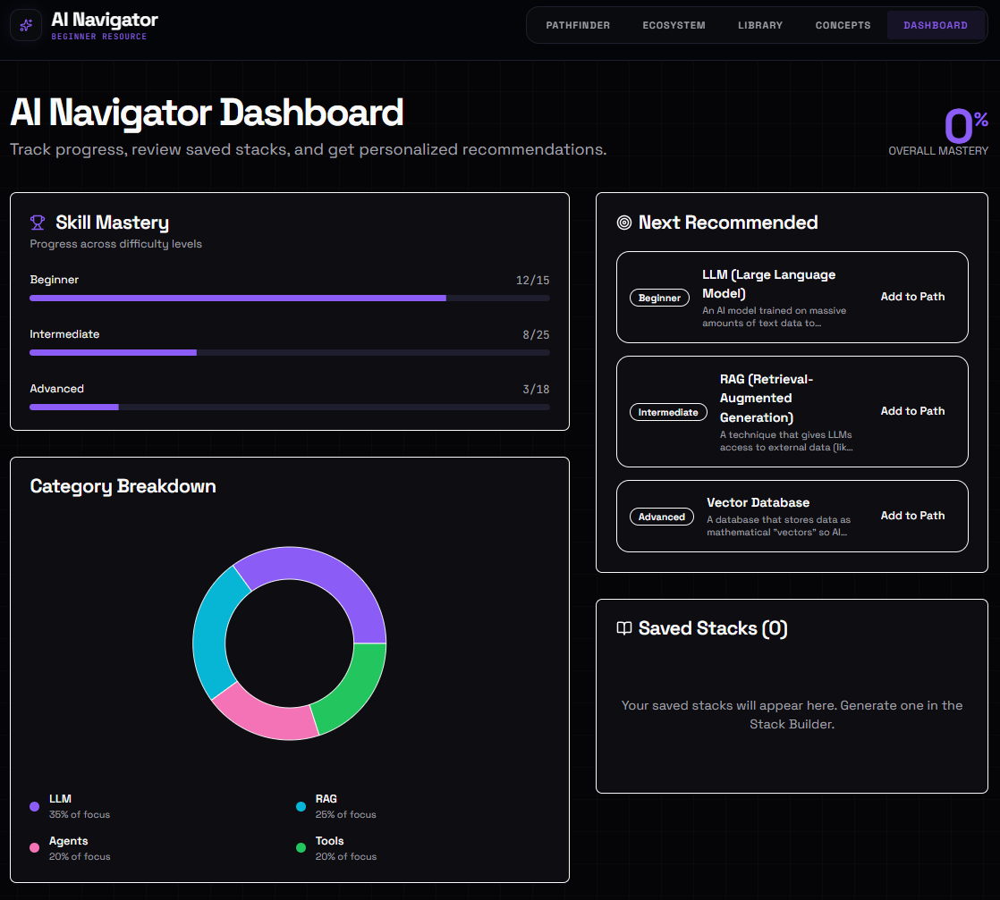

# AI Navigator

**A beginner-friendly map of the 2026 AI ecosystem — generate architectures, explore tools, and follow a learning path.**

🌐 **Live:** [ai-navigator.leffel.io](https://ai-navigator.leffel.io)

Tell the Pathfinder what you want to build and it returns a working stack with cost estimate and execution flow. Browse 154 tools and concepts in the Library, see how they connect in the Ecosystem map, and track your progress on the Dashboard.

Built with **React 19**, **shadcn/ui**, **Tailwind v4**, and **Cloudflare Workers AI** — no API keys, no third-party services.

[](https://www.typescriptlang.org/)
[](https://react.dev/)
[](https://tailwindcss.com/)
[](https://vitejs.dev/)
[](https://pages.cloudflare.com/)

## Features

- **Pathfinder** — Describe a project in plain English and get a beginner-friendly architecture: recommended tools, cost estimate, and execution flow. Powered by Llama 3.1 8B Instruct via Workers AI.
- **Ecosystem Map** — Interactive d3 force-directed graph of how tools, frameworks, and concepts relate (`works best with`, `depends on`, `alternative to`).
- **Library** — 154 curated tools with search, plus difficulty (Beginner / Intermediate / Advanced), pricing (Free / Freemium / Paid), and category filters.
- **Concept Skill Tree** — Visual learning path through core AI concepts grouped by difficulty.
- **Dashboard** — Skill mastery breakdown, category focus chart, next-recommended concepts, and saved stacks from the Pathfinder.
- **Tool Deep-Dive** — Click any tool to get an AI-generated markdown explainer plus its ecosystem connections, all rendered inside a modal.
- **Global Search** — `Cmd/Ctrl + K` opens a command palette for instant fuzzy search across the whole catalog.

## Screenshots

### Pathfinder
Generate a complete architecture from a single prompt — model picks, cost estimate, and execution flow.



### Library
Filter 154 tools by difficulty, pricing tier, and category. Click into any card for an AI deep-dive.



### Concept Deep-Dive
Each concept opens in a modal with a beginner-friendly explainer and a map of related tools.



### Dashboard
Track skill mastery across difficulty levels, see your category focus, and revisit saved stacks.



## Quick Start

```bash
git clone https://github.com/cLeffNote44/ai-navigator.git
cd ai-navigator
npm install
npm run dev
```

Open [http://localhost:3000](http://localhost:3000). The dev server runs the frontend only — Pathfinder and tool deep-dive calls hit the Pages Functions, so for end-to-end AI features run the full stack:

```bash
npm run build
npm run pages:dev
```

Wrangler will prompt you to log in to Cloudflare on first run and binds the Workers AI `AI` binding automatically.

**Tip:** press `Cmd/Ctrl + K` anywhere for the search palette.

## Tech Stack

| Layer    | Choice                                                            |
| -------- | ----------------------------------------------------------------- |
| Frontend | React 19, TypeScript, Vite, Tailwind v4, shadcn/ui, Recharts, d3  |
| AI       | Cloudflare Workers AI — Llama 3.1 8B (fast) and 3.3 70B           |
| API      | Cloudflare Pages Functions, Zod-validated structured outputs      |
| Hosting  | Cloudflare Pages                                                  |
| State    | React hooks + `localStorage`                                      |

## Project Structure

```
ai-navigator/
├── components/
│   ├── ui/                  # shadcn/ui primitives
│   ├── Pathfinder.tsx       # Goal → architecture blueprint
│   ├── RelationMap.tsx      # d3 ecosystem force graph
│   ├── SkillTree.tsx
│   └── ToolDetailModal.tsx
├── pages/
│   ├── ExplorerPage.tsx     # Ecosystem tab
│   ├── AllToolsPage.tsx     # Library tab
│   ├── ConceptsPage.tsx     # Concepts tab
│   └── DashboardPage.tsx
├── functions/api/
│   ├── tool-details.ts      # Workers AI: markdown explainer
│   └── generate-stack.ts    # Workers AI: structured JSON stack
├── services/aiService.ts    # Client → Pages Function bridge
├── constants.tsx            # 154-entry AI catalog with relations
├── wrangler.toml            # Workers AI binding
└── index.css                # Tailwind v4 @theme tokens
```

## Deploying to Cloudflare Pages

1. Push the repo to GitHub.
2. **Cloudflare dashboard → Pages → Create → Connect to Git**, select the repo.
3. Build command: `npm run build`. Output directory: `dist`.
4. **Settings → Functions → Bindings**: add a **Workers AI** binding named `AI`.
5. Optional: under **Custom Domains**, attach your domain. Cloudflare handles SSL automatically.

Billing is per Workers AI neuron on your Cloudflare account — no third-party API keys.

## Roadmap

- [x] 154-entry AI catalog with cross-tool relations
- [x] Pathfinder architecture generator (structured JSON output)
- [x] d3 ecosystem map
- [x] Library with multi-axis filters
- [x] Concept skill tree
- [x] Dashboard with progress charts and saved stacks
- [x] AI-generated tool deep-dives
- [x] Cmd+K command palette
- [ ] Light-mode polish (currently dark-only)
- [ ] User accounts and shared stacks
- [ ] Real vector embeddings for semantic search
- [ ] Community tool submissions

## Contributing

PRs welcome. To add tools, edit `constants.tsx` — keep `id` unique, fill in `relations` so the Ecosystem map stays connected, and pick the right `difficulty` / `pricingTier`.

## License

MIT © 2026 — see [LICENSE](LICENSE).
